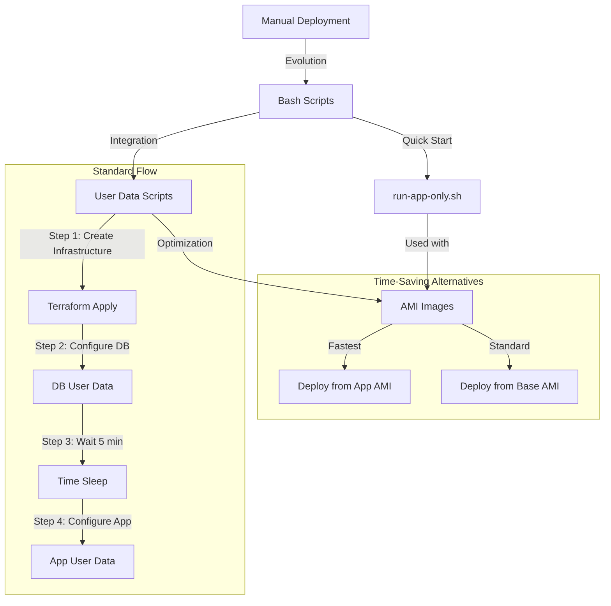

# Two-Tier Application Deployment Automation

## Table of Contents

- [Two-Tier Application Deployment Automation](#two-tier-application-deployment-automation)
  - [Table of Contents](#table-of-contents)
  - [Introduction](#introduction)
    - [The Problem](#the-problem)
    - [The Solution](#the-solution)
  - [Architecture \& Workflow](#architecture--workflow)
  - [Scripts Overview](#scripts-overview)
    - [1. `prov-app.sh` (Application Provisioning)](#1prov-appshapplication-provisioning)
    - [2. `prov-db.sh` (Database Provisioning)](#2prov-dbshdatabase-provisioning)
    - [3. `run-app-only.sh` (Quick Start Script)](#3run-app-onlyshquick-start-script)
  - [Deployment Strategies](#deployment-strategies)
    - [Standard Deployment](#standard-deployment)
    - [Time-Optimized Deployment](#time-optimized-deployment)
  - [Blockers and Solutions](#blockers-and-solutions)
    - [1. Service Restart Prompts](#1-service-restart-prompts)
    - [2. Database Connection Timing](#2-database-connection-timing)
    - [3. Environment Variables](#3-environment-variables)
  - [Key Learnings](#key-learnings)
  - [Benefits](#benefits)
  - [Conclusion \& Next Steps](#conclusion--next-steps)

---

## Introduction

### The Problem

Manually deploying a two-tier application (Node.js + MongoDB) on cloud virtual machines can be:

- **Time-consuming**: Numerous manual steps across multiple servers.
- **Error-prone**: High risk of mistakes in repetitive configurations.
- **Hard to replicate**: Inconsistent environments lead to “it works on my machine” scenarios.
- **Difficult to maintain**: Large room for human error when updating or scaling.

### The Solution

This project automates the entire process using:

- **Terraform** for infrastructure provisioning.
- **Bash scripts** to configure and install required packages.
- **User data** for hands-off setup on instance creation.
- **AMI (Amazon Machine Image)** to speed up repeated deployments.

By combining these tools, you can deploy and configure both the application and database tiers in a matter of minutes—while ensuring consistent, repeatable results.

---

## Architecture & Workflow

Below is a high-level view of the automation workflow. It shows how manual deployment evolved into scripted deployments, then user data, and finally optimized AMI-based approaches.

  



  **Key Takeaways from the Diagram**:

1. **Manual Deployment** is the slowest and most error-prone.
2. **Bash Scripts** eliminate manual repetition but still require user involvement to run them.
3. **User Data** allows scripts to run automatically upon VM creation.
4. **AMI Images** can drastically reduce provisioning time by bundling pre-configured environments.

---

## Scripts Overview

Below is an overview of each script, its purpose, and key components.

### 1. `prov-app.sh` (Application Provisioning)

**Purpose**  
Automates the full setup of the Node.js application tier on a fresh Linux (Ubuntu) virtual machine.

**Key Components**

```bash

# System Preparation

- Configures needrestart for non-interactive mode

- Updates system packages

- Installs and configures Nginx

  

# Application Setup

- Installs Node.js 20.x and npm

- Installs PM2 globally

- Clones application repository

  

# Configuration

- Sets up Nginx reverse proxy to Node.js app

- Configures environment variables

- Initializes PM2 process management

```

**Features**

- **Idempotent Execution**: Safe to run multiple times without breaking existing configurations.
- **Comprehensive Logging**: Uses `echo` or similar to display progress and any errors.
- **Minimal Manual Intervention**: Runs fully unattended, including service restarts.

### 2. `prov-db.sh` (Database Provisioning)

**Purpose**  
Sets up and configures MongoDB on a fresh Linux (Ubuntu) virtual machine.

**Key Components**

```bash

# System Setup

- Configures needrestart

- Updates system packages

- Installs dependencies (gnupg, curl)

  

# MongoDB Installation

- Imports MongoDB 7.0 GPG key

- Adds official MongoDB repository

- Installs specific MongoDB version (7.0.6)

  

# Security Configuration

- Configures MongoDB to accept remote connections

- Sets up service management

- Implements backup configuration

```

  **Features**

- **Version-Specific Installation**: Ensures consistent MongoDB version (7.0.6).
- **Remote Access Configuration**: Allows the Node.js app to connect from another VM.
- **Automatic Service Management**: Starts MongoDB service and enables it on reboot.

### 3. `run-app-only.sh` (Quick Start Script)

**Purpose**  
Used primarily with an already-configured AMI to quickly bring the application online without installing dependencies again.

**Key Components**

```bash

# Environment Setup

- Validates application directory

- (Optional) Configures database connection

  

# Application Launch

- (Optional) Updates npm dependencies

- Manages PM2 processes

- Ensures persistent configuration

```

  

**Usage Scenarios**

1. **Quick Recovery**: Spin up a new app VM using an AMI, then run only the final steps (e.g., connecting to DB, starting the app).
2. **Scaling**: Rapidly deploy multiple app servers with minimal overhead.

---

## Deployment Strategies

### Standard Deployment

1. **Provision Infrastructure**: Use Terraform to create two EC2 instances—one for the database and one for the application.
2. **Configure DB**: Either SSH in and run `prov-db.sh` or pass it via user data.
3. **Configure App**: Similarly, use `prov-app.sh` or pass it via user data.
4. **Validate**: Check that Node.js is running on the app instance and MongoDB is accessible.

**Pros**

- Full control over every step.
- Easy to debug if something goes wrong.

**Cons**

- Slower, because it installs all dependencies on every new instance.

### Time-Optimized Deployment

1. **Create Infrastructure** with Terraform or manually in AWS.
2. **Use AMIs** that already have the app or database installed.
3. **Use `run-app-only.sh`** in user data to finalize the app configuration (e.g., set `DB_HOST`, run `pm2 start app.js`).

**Pros**

- Much faster, as the VM is already preconfigured.
- Ideal for scaling or quick recovery scenarios.

**Cons**

- Must maintain and update AMIs as dependencies change.
  

## Blockers and Solutions

  
### 1. Service Restart Prompts

**Issue:** Ubuntu's needrestart service blocking automated setup

**Reason:** Default configuration requires user input

**Solution:** Configure needrestart in non-interactive mode:

```bash

sed -i 's/^#\?NEEDRESTART_MODE=.*/NEEDRESTART_MODE="a"/' /etc/needrestart/needrestart.conf

```

  

### 2. Database Connection Timing

**Issue:** Application failing to start due to database unavailability

**Reason:** Database initialization taking longer than expected

**Solution:** Implemented 5-minute delay using Terraform:

```hcl

resource "time_sleep" "wait_5_mins" {

depends_on = [aws_instance.db_instance]

create_duration = "300s"

}

```

  

### 3. Environment Variables

**Issue:** DB_HOST environment variable not persisting

**Reason:** Environment variables lost after session ends

**Solution:** Added to system-wide environment file:

```bash

echo "DB_HOST=mongodb://${db_private_ip}:27017/posts" | sudo tee -a /etc/environment

```

  
## Key Learnings

4. **Script Idempotency**
    
    - Avoid duplication by checking for existing packages and configurations.
    - Write scripts that can run multiple times without breaking.
5. **Error Handling & Logging**
    
    - Use `echo` statements to show progress before each major step.
    - Provide clear messages for both success and failure.
6. **User Data Best Practices**
    
    - Remember that user data runs as `root` from `/`.
    - Include explicit `cd` commands when working with cloned repositories.
    - Check logs in `/var/log/cloud-init-output.log` (AWS) or `/var/log/waagent.log` (Azure) to troubleshoot.
7. **Optimization Techniques**
    
    - Use AMIs to avoid repeated installations.
    - Combine `prov-app.sh` and `prov-db.sh` with user data for hands-free deployments.
    - Leverage Terraform’s `depends_on` and `time_sleep` resources to ensure correct sequencing.

---

## Benefits

8. **Time Efficiency**
    
    - Deployment reduced from hours to minutes.
    - Consistent, repeatable process without manual steps.
9. **Consistency & Reliability**
    
    - Eliminates human error by automating configurations.
    - Identical setups across all environments.
10. **Maintainability**
    
    - Modular Bash scripts can be easily updated.
    - Clear separation of concerns: infrastructure vs. configuration.
11. **Scalability**
    
    - Rapidly spin up or tear down environments.
    - AMI-based approach enables near-instant deployment of additional app servers.

---

## Conclusion & Next Steps

By integrating Bash scripts, user data, and AMIs, this project delivers a robust and efficient way to deploy a two-tier Node.js and MongoDB application on cloud platforms like AWS.

**Recommended Next Steps**:

12. **Extend Terraform**: Incorporate security group rules (ports 27017 for MongoDB, 80/443 for Nginx) and parameterize instance sizes.
13. **Implement CI/CD**: Use GitHub Actions or another CI tool to trigger provisioning automatically when code changes.
14. **Refine Monitoring**: Add CloudWatch (AWS) or Azure Monitor to track instance health, application logs, and performance metrics.
15. **Automate Image Creation**: Use Packer or similar tools to automate building and updating AMIs, ensuring you always have an up-to-date “golden image.”

With this foundation in place, you can quickly adapt to new requirements, easily maintain your environment, and scale your application tiers as needed—ensuring a stable, efficient, and secure deployment pipeline.