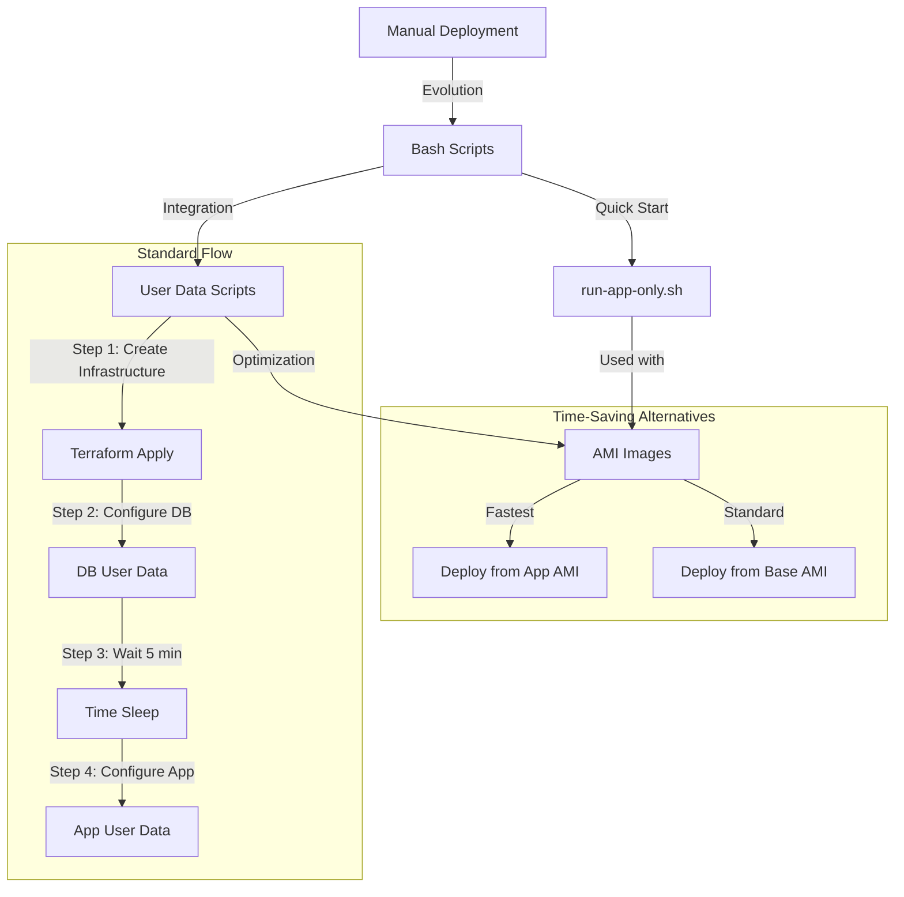

# Two-Tier Application Deployment Automation

## Introduction

### The Problem
Deploying a two-tier application (Node.js + MongoDB) manually on AWS EC2 instances presents several challenges:
- Time-consuming manual configuration of multiple servers
- Potential for human error during setup
- Lack of reproducibility across deployments
- Difficulty in maintaining consistent configurations
- Complex coordination between application and database tiers

### The Solution
This project provides an automated deployment solution using:
- Terraform for infrastructure provisioning
- Shell scripts for instance configuration
- User data for automated setup
- AMI capabilities for rapid deployment

## Automation Workflow



## Script Implementation Details

### 1. prov-app.sh (Application Provisioning)

Purpose: Fully automate the setup of the application tier.

Key Components:
```bash
# System Preparation
- Configures needrestart for non-interactive mode
- Updates system packages
- Installs and configures Nginx

# Application Setup
- Installs Node.js 20.x and npm
- Installs PM2 globally
- Clones application repository

# Configuration
- Sets up Nginx reverse proxy to Node.js app
- Configures environment variables
- Initializes PM2 process management
```

Features:
- Idempotent execution (safe to run multiple times)
- Comprehensive error handling
- Detailed status reporting
- Automatic service configuration

### 2. prov-db.sh (Database Provisioning)

Purpose: Automate MongoDB database setup and configuration.

Key Components:
```bash
# System Setup
- Configures needrestart
- Updates system packages
- Installs dependencies (gnupg, curl)

# MongoDB Installation
- Imports MongoDB 7.0 GPG key
- Adds official MongoDB repository
- Installs specific MongoDB version (7.0.6)

# Security Configuration
- Configures MongoDB to accept remote connections
- Sets up service management
- Implements backup configuration
```

Features:
- Version-specific installation
- Secure configuration
- Automatic service management
- Configuration backup creation

### 3. run-app-only.sh (Quick Start Script)

Purpose: Rapidly deploy application from pre-configured AMI.

Key Components:
```bash
# Environment Setup
- Validates application directory
- Configures database connection

# Application Launch
- Updates npm dependencies
- Manages PM2 processes
- Ensures persistent configuration
```

Usage Scenarios:
1. Quick Recovery:
   - Use with AMI for rapid deployment
   - Minimal configuration required
   - Faster than full provisioning

2. Scaling:
   - Deploy multiple app instances quickly
   - Consistent configuration across instances
   - Reduced deployment time

## Deployment Strategies

### Standard Deployment
1. Full provisioning using prov-app.sh and prov-db.sh
   - Complete system setup
   - Longer deployment time
   - Maximum flexibility

### Time-Optimized Deployment
1. Create AMI after successful deployment
2. Use run-app-only.sh for subsequent deployments
   - Significantly reduced deployment time
   - Consistent environment
   - Minimal configuration needed

## Blockers and Solutions

### 1. Service Restart Prompts
**Issue:** Ubuntu's needrestart service blocking automated setup
**Reason:** Default configuration requires user input
**Solution:** Configure needrestart in non-interactive mode:
```bash
sed -i 's/^#\?NEEDRESTART_MODE=.*/NEEDRESTART_MODE="a"/' /etc/needrestart/needrestart.conf
```

### 2. Database Connection Timing
**Issue:** Application failing to start due to database unavailability
**Reason:** Database initialization taking longer than expected
**Solution:** Implemented 5-minute delay using Terraform:
```hcl
resource "time_sleep" "wait_5_mins" {
  depends_on = [aws_instance.db_instance]
  create_duration = "300s"
}
```

### 3. Environment Variables
**Issue:** DB_HOST environment variable not persisting
**Reason:** Environment variables lost after session ends
**Solution:** Added to system-wide environment file:
```bash
echo "DB_HOST=mongodb://${db_private_ip}:27017/posts" | sudo tee -a /etc/environment
```

## Learnings

1. **Script Idempotency**
   - Importance of checking existing installations
   - Handling repeated executions gracefully
   - Preventing duplicate configurations

2. **Error Handling**
   - Comprehensive logging implementation
   - Clear error messages and status checks
   - Fail-fast approach for critical errors

3. **Optimization Techniques**
   - AMI usage for faster deployments
   - Parallel processing where possible
   - Resource dependency management

## Benefits

1. **Time Efficiency**
   - Reduced deployment time from hours to minutes
   - Automated configuration eliminates manual steps
   - Quick recovery from failures

2. **Consistency**
   - Identical configurations across deployments
   - Eliminated human error in setup
   - Reproducible infrastructure

3. **Maintainability**
   - Well-documented deployment process
   - Modular script design
   - Easy to update and modify

4. **Scalability**
   - Easy to replicate for multiple environments
   - Supports different deployment strategies
   - Adaptable to changing requirements
