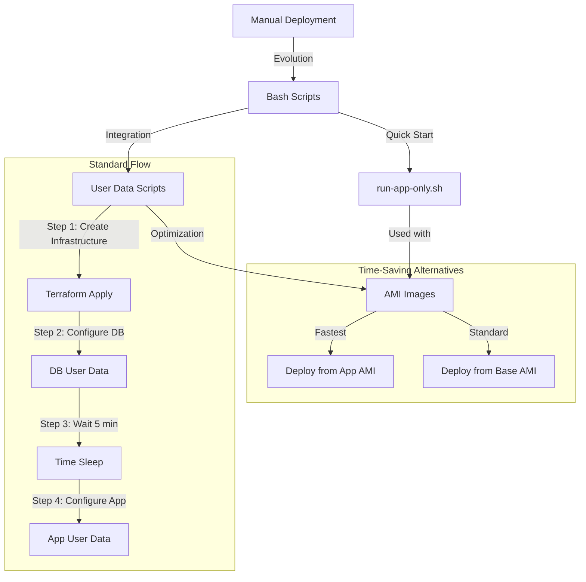

# Two-Tier Application Deployment Automation

## Table of Contents

- [Two-Tier Application Deployment Automation](#two-tier-application-deployment-automation)
  - [Table of Contents](#table-of-contents)
  - [Introduction](#introduction)
    - [The Problem](#the-problem)
    - [The Solution](#the-solution)
  - [Architecture \& Workflow](#architecture--workflow)
  - [Step-by-Step Implementation](#step-by-step-implementation)
    - [1. AWS Infrastructure Setup](#1-aws-infrastructure-setup)
      - [VPC and Network Configuration](#vpc-and-network-configuration)
      - [Security Groups](#security-groups)
      - [Instance Configuration](#instance-configuration)
    - [2. Terraform Implementation](#2-terraform-implementation)
      - [Provider Setup](#provider-setup)
      - [Resource Creation Order](#resource-creation-order)
    - [3. Database Tier Implementation](#3-database-tier-implementation)
      - [Manual Testing Phase](#manual-testing-phase)
      - [Script Development (prov-db.sh)](#script-development-prov-dbsh)
      - [User Data Integration](#user-data-integration)
    - [4. Application Tier Implementation](#4-application-tier-implementation)
      - [Manual Testing Phase](#manual-testing-phase-1)
      - [Script Development (prov-app.sh)](#script-development-prov-appsh)
      - [AMI Creation](#ami-creation)
    - [5. Testing and Validation](#5-testing-and-validation)
      - [Database Testing](#database-testing)
      - [Application Testing](#application-testing)
      - [Performance Testing](#performance-testing)
  - [Script Implementation Details](#script-implementation-details)
    - [1. Application Provisioning Script (prov-app.sh)](#1-application-provisioning-script-prov-appsh)
    - [2. Database Provisioning Script (prov-db.sh)](#2-database-provisioning-script-prov-dbsh)
    - [3. Quick Start Script (run-app-only.sh)](#3-quick-start-script-run-app-onlysh)
  - [Scripts Overview](#scripts-overview)
    - [1. `prov-app.sh` (Application Provisioning)](#1prov-appshapplication-provisioning)
    - [2. `prov-db.sh` (Database Provisioning)](#2prov-dbshdatabase-provisioning)
    - [3. `run-app-only.sh` (Quick Start Script)](#3run-app-onlyshquick-start-script)
  - [Deployment Strategies](#deployment-strategies)
    - [Standard Deployment](#standard-deployment)
    - [Time-Optimized Deployment](#time-optimized-deployment)
  - [Blockers and Solutions](#blockers-and-solutions)
    - [1. Service Restart Prompts](#1-service-restart-prompts)
    - [2. Database Connection Timing](#2-database-connection-timing)
    - [3. Environment Variables](#3-environment-variables)
  - [Key Learnings](#key-learnings)
  - [Benefits](#benefits)
  - [Conclusion \& Next Steps](#conclusion--next-steps)

---

## Introduction

### The Problem

Manually deploying a two-tier application (Node.js + MongoDB) on cloud virtual machines can be:

- **Time-consuming**: Numerous manual steps across multiple servers.
- **Error-prone**: High risk of mistakes in repetitive configurations.
- **Hard to replicate**: Inconsistent environments lead to “it works on my machine” scenarios.
- **Difficult to maintain**: Large room for human error when updating or scaling.

### The Solution

This project automates the entire process using:

- **Terraform** for infrastructure provisioning.
- **Bash scripts** to configure and install required packages.
- **User data** for hands-off setup on instance creation.
- **AMI (Amazon Machine Image)** to speed up repeated deployments.

By combining these tools, you can deploy and configure both the application and database tiers in a matter of minutes—while ensuring consistent, repeatable results.

---

## Architecture & Workflow

Below is a high-level view of the automation workflow. It shows how manual deployment evolved into scripted deployments, then user data, and finally optimized AMI-based approaches.

  



**Key Takeaways from the Diagram**:

1. **Manual Deployment** is the slowest and most error-prone.
2. **Bash Scripts** eliminate manual repetition but still require user involvement to run them.
3. **User Data** allows scripts to run automatically upon VM creation.
4. **AMI Images** can drastically reduce provisioning time by bundling pre-configured environments.

---

## Step-by-Step Implementation

This section details the exact steps taken to implement the two-tier application deployment automation.

### 1. AWS Infrastructure Setup

#### VPC and Network Configuration
- Used default VPC for simplicity and cost-effectiveness
- Leveraged default subnet with auto-assigned public IPs
- Configured Internet Gateway for public access

#### Security Groups
```hcl
# App Security Group Rules
- Inbound: 
  - Port 22 (SSH)
  - Port 80 (HTTP)
  - Port 3000 (Node.js app)
- Outbound: All traffic

# Database Security Group Rules
- Inbound:
  - Port 22 (SSH)
  - Port 27017 (MongoDB) from App Security Group
- Outbound: All traffic
```

#### Instance Configuration
- Selected Ubuntu 22.04 LTS AMI for consistency
- Chose t3.micro instances for cost-effectiveness
- Created and downloaded key pair for SSH access

### 2. Terraform Implementation

#### Provider Setup
```hcl
provider "aws" {
  region = "eu-west-1"
}
```

#### Resource Creation Order
1. Security Groups:
   ```hcl
   resource "aws_security_group" "app_sg" {
     name        = "app-security-group"
     description = "Security group for app server"
     vpc_id      = data.aws_vpc.default.id
     # Ingress and egress rules defined here
   }
   ```

2. Database Instance:
   ```hcl
   resource "aws_instance" "db_instance" {
     ami           = var.instance_ami_id
     instance_type = var.instance_type
     user_data     = base64encode(file("scripts/db_userdata.sh"))
     # Other configurations
   }
   ```

3. Time Delay:
   ```hcl
   resource "time_sleep" "wait_5_mins" {
     depends_on = [aws_instance.db_instance]
     create_duration = "300s"
   }
   ```

4. Application Instance:
   ```hcl
   resource "aws_instance" "app_instance" {
     depends_on = [time_sleep.wait_5_mins]
     ami       = var.instance_ami_id
     user_data = base64encode(file("scripts/app_userdata.sh"))
     # Other configurations
   }
   ```

### 3. Database Tier Implementation

#### Manual Testing Phase
1. Launched Ubuntu 22.04 instance
2. Tested MongoDB installation commands:
   ```bash
   sudo apt update
   sudo apt install -y gnupg curl
   # MongoDB repository setup
   curl -fsSL https://pgp.mongodb.com/server-7.0.asc | \
     sudo gpg -o /usr/share/keyrings/mongodb-server-7.0.gpg \
     --dearmor
   ```

#### Script Development (prov-db.sh)
1. Added error handling
2. Implemented idempotency checks
3. Added logging
4. Configured MongoDB for remote access

#### User Data Integration
1. Base64 encoded script
2. Added to Terraform configuration
3. Tested deployment
4. Verified MongoDB accessibility

### 4. Application Tier Implementation

#### Manual Testing Phase
1. Launched Ubuntu 22.04 instance
2. Tested Node.js installation:
   ```bash
   curl -fsSL https://deb.nodesource.com/setup_20.x | sudo -E bash -
   sudo apt-get install -y nodejs
   ```
3. Verified Nginx configuration
4. Tested PM2 installation and operation

#### Script Development (prov-app.sh)
1. Implemented system updates
2. Added Node.js and PM2 installation
3. Configured Nginx reverse proxy
4. Set up application deployment

#### AMI Creation
1. Created AMI from fully configured app instance
2. Developed run-app-only.sh for quick deployment
3. Tested AMI deployment with minimal user data

### 5. Testing and Validation

#### Database Testing
1. Verified MongoDB service status
2. Tested remote connectivity
3. Checked log files for errors
4. Validated security group rules

#### Application Testing
1. Verified Node.js application startup
2. Tested Nginx reverse proxy
3. Validated posts functionality
4. Checked PM2 process management

#### Performance Testing
1. Tested application response times
2. Verified database queries
3. Monitored resource utilization
4. Validated AMI deployment speed

---

## Script Implementation Details

### 1. Application Provisioning Script (prov-app.sh)

```bash
#!/bin/bash
set -e

# Usage: ./sparta.sh
# This script installs and configures the App Tier (Nginx, Node.js, and PM2) on Ubuntu 22.04.
# It also configures needrestart to automatically restart services without prompts.
# The script is idempotent so that previously completed steps are skipped.

# Ensure the script is run as root
if [ "$EUID" -ne 0 ]; then
  echo "Please run as root (or with sudo)."
  exit 1
fi

echo "----------------------------------------------"
echo "Configuring needrestart for non-interactive mode..."
# Only update if the configuration doesn't already have NEEDRESTART_MODE="a"
if grep -q '^NEEDRESTART_MODE="a"' /etc/needrestart/needrestart.conf; then
  echo "needrestart is already set to non-interactive mode."
else
  sed -i 's/^#\?NEEDRESTART_MODE=.*/NEEDRESTART_MODE="a"/' /etc/needrestart/needrestart.conf
  echo "needrestart configuration updated."
fi
export NEEDRESTART_SILENT=1
export NEEDRESTART_MODE=a

echo "=============================================="
echo "Setting up App Tier (Nginx, Node.js, PM2)..."
echo "=============================================="

echo "Updating system packages..."
apt-get update -qq > /dev/null 2>&1
apt-get upgrade -y -qq > /dev/null 2>&1

echo "Installing nginx (if not already installed)..."
if dpkg -l | grep -qw nginx; then
  echo "nginx is already installed."
else
  DEBIAN_FRONTEND=noninteractive apt install -y nginx > /dev/null 2>&1
  echo "nginx installed."
fi

echo "Enabling and starting nginx (if not already active)..."
if systemctl is-active --quiet nginx; then
  echo "nginx service is already running."
else
  systemctl start nginx > /dev/null 2>&1
  echo "nginx service started."
fi

if systemctl is-enabled --quiet nginx; then
  echo "nginx service is already enabled."
else
  systemctl enable nginx > /dev/null 2>&1
  echo "nginx service enabled."
fi

echo "Installing Node.js and npm (if not already installed)..."
if command -v node >/dev/null 2>&1; then
  echo "Node.js is already installed."
else
  DEBIAN_FRONTEND=noninteractive bash -c "curl -fsSL https://deb.nodesource.com/setup_20.x | bash -" > /dev/null 2>&1
  DEBIAN_FRONTEND=noninteractive apt install -y nodejs > /dev/null 2>&1
  echo "Node.js installed."
fi

echo "Installing PM2 globally (if not already installed)..."
if command -v pm2 >/dev/null 2>&1; then
  echo "PM2 is already installed."
else
  npm install -g pm2 > /dev/null 2>&1
  echo "PM2 installed."
fi

echo "Cloning Node.js app repository (if not already cloned)..."
if [ -d "/repo/.git" ]; then
  echo "Repository already cloned."
else
  git clone https://github.com/stravos97/node-sparta-test-app.git /repo > /dev/null 2>&1
  echo "Repository cloned to /repo."
fi

echo "Configuring Nginx reverse proxy..."
# Check if the default config already has the desired proxy_pass setting.
if grep -q "proxy_pass http://127.0.0.1:3000;" /etc/nginx/sites-available/default; then
  echo "Nginx reverse proxy is already configured."
else
  sed -i 's|try_files.*|proxy_pass http://127.0.0.1:3000;|' /etc/nginx/sites-available/default
  echo "Nginx reverse proxy configured."
fi

echo "Reloading nginx configuration..."
systemctl reload nginx > /dev/null 2>&1

# Uncomment and set the DB_HOST variable if you need to connect to a MongoDB server
# export DB_HOST=mongodb://<db_private_ip>:27017/posts

echo "Changing directory to the app repository..."
if [ -d "/repo/app" ]; then
  cd /repo/app
else
  echo "Error: /repo/app directory not found."
  exit 1
fi

npm install > /dev/null 2>&1

echo "Starting the Node.js app with PM2..."
# Check if PM2 already has a process running for app.js (using a process name "app" for idempotence)
if pm2 describe app > /dev/null 2>&1; then
  echo "Node.js app is already running in PM2."
else
  pm2 start app.js --name app > /dev/null 2>&1
  echo "Node.js app started with PM2."
fi

echo "=============================================="
echo "Final Configuration and Service Statuses"
echo "=============================================="

echo "Current 'proxy_pass' configuration in Nginx:"
grep "proxy_pass" /etc/nginx/sites-available/default

echo "----------------------------------------------"
echo "Nginx service status:"
systemctl status nginx --no-pager

echo "----------------------------------------------"
echo "PM2 process list:"
pm2 list
```

**How It Works:**

1. **Initial Setup**
   - Sets error handling with `set -e`
   - Checks for root privileges
   - Configures needrestart for non-interactive mode

2. **System Updates**
   - Updates package lists
   - Upgrades existing packages
   - Uses `-qq` for quiet operation and redirects output to /dev/null

3. **Nginx Installation & Configuration**
   - Checks if nginx is already installed using `dpkg -l`
   - Installs nginx if not present
   - Configures reverse proxy to forward requests to Node.js app
   - Ensures service is running and enabled

4. **Node.js Setup**
   - Adds NodeSource repository for Node.js 20.x
   - Installs Node.js and npm
   - Installs PM2 globally for process management

5. **Application Deployment**
   - Clones application repository to /repo
   - Sets up environment variables
   - Installs dependencies with npm
   - Starts application using PM2

### 2. Database Provisioning Script (prov-db.sh)

```bash
#!/bin/bash
set -e

# Usage: ./sparta.sh
# This script installs and configures MongoDB on Ubuntu 22.04.
# It also configures needrestart to automatically restart services without prompts.
# The script is designed to be idempotent, so steps already executed are skipped.

# Ensure the script is run as root
if [ "$EUID" -ne 0 ]; then
  echo "Please run as root (or with sudo)."
  exit 1
fi

echo "----------------------------------------------"
echo "Configuring needrestart for non-interactive mode..."
# Only update the configuration if it doesn't already have auto mode enabled.
if grep -q '^NEEDRESTART_MODE="a"' /etc/needrestart/needrestart.conf; then
  echo "needrestart is already configured for auto mode."
else
  sed -i 's/^#\?NEEDRESTART_MODE=.*/NEEDRESTART_MODE="a"/' /etc/needrestart/needrestart.conf
  echo "needrestart configuration updated."
fi
export NEEDRESTART_SILENT=1
export NEEDRESTART_MODE=a

echo "Running system upgrade in non-interactive mode..."
DEBIAN_FRONTEND=noninteractive apt-get \
  -o Dpkg::Options::="--force-confdef" \
  -o Dpkg::Options::="--force-confold" \
  upgrade -y > /dev/null 2>&1

echo "=============================================="
echo "Setting up Database Tier (MongoDB)..."
echo "=============================================="

echo "Updating package lists..."
apt-get update -qq > /dev/null 2>&1

echo "Upgrading system packages..."
apt-get upgrade -y -qq > /dev/null 2>&1

echo "Installing gnupg and curl (if not already installed)..."
for pkg in gnupg curl; do
  if dpkg -l | grep -qw "$pkg"; then
    echo "$pkg is already installed."
  else
    apt-get install -y "$pkg" > /dev/null 2>&1
    echo "$pkg installed."
  fi
done

echo "Importing MongoDB public key (if not already imported)..."
if [ -f /usr/share/keyrings/mongodb-server-7.0.gpg ]; then
  echo "MongoDB public key already exists."
else
  curl -fsSL https://pgp.mongodb.com/server-7.0.asc | gpg --dearmor -o /usr/share/keyrings/mongodb-server-7.0.gpg
  echo "MongoDB public key imported."
fi

echo "Adding MongoDB repository (if not already added)..."
if [ -f /etc/apt/sources.list.d/mongodb-org-7.0.list ]; then
  echo "MongoDB repository already exists."
else
  echo "deb [ arch=amd64,arm64 signed-by=/usr/share/keyrings/mongodb-server-7.0.gpg ] https://repo.mongodb.org/apt/ubuntu jammy/mongodb-org/7.0 multiverse" \
    | tee /etc/apt/sources.list.d/mongodb-org-7.0.list > /dev/null 2>&1
  echo "MongoDB repository added."
fi

echo "Updating package lists after adding MongoDB repository..."
apt-get update -qq > /dev/null 2>&1

echo "Installing MongoDB packages (if not already installed)..."
if command -v mongod >/dev/null 2>&1; then
  echo "MongoDB packages are already installed."
else
  apt-get install -y mongodb-org=7.0.6 mongodb-org-database=7.0.6 mongodb-org-server=7.0.6 \
                     mongodb-mongosh mongodb-org-mongos=7.0.6 mongodb-org-tools=7.0.6 > /dev/null 2>&1
  echo "MongoDB packages installed."
fi

echo "Configuring MongoDB to bind to all IP addresses (if not already configured)..."
if grep -q "bindIp: 0.0.0.0" /etc/mongod.conf; then
  echo "MongoDB already configured to bind to all IP addresses."
else
  sed -i.bak 's/bindIp: 127.0.0.1/bindIp: 0.0.0.0/' /etc/mongod.conf
  echo "MongoDB bindIp configuration updated."
fi

echo "Starting MongoDB service (if not already running)..."
if systemctl is-active --quiet mongod; then
  echo "MongoDB service is already running."
else
  systemctl start mongod > /dev/null 2>&1
  echo "MongoDB service started."
fi

echo "Enabling MongoDB service (if not already enabled)..."
if systemctl is-enabled --quiet mongod; then
  echo "MongoDB service is already enabled."
else
  systemctl enable mongod > /dev/null 2>&1
  echo "MongoDB service enabled."
fi

echo "Fetching MongoDB service status..."
systemctl status mongod --no-pager

echo "----------------------------------------------"
echo "Verifying MongoDB installation..."
if command -v mongod >/dev/null 2>&1; then
  echo "MongoDB installed successfully!"
  echo "MongoDB version info:"
  mongod --version | head -n 1
else
  echo "Error: mongod command not found. Installation may have failed."
fi

echo "----------------------------------------------"
BIND_IP=$(grep -E '^\s*bindIp:\s*' /etc/mongod.conf | awk '{print $2}')
echo "Current MongoDB bindIp: $BIND_IP"
echo "----------------------------------------------"
echo "MongoDB installation and configuration complete."
```

**How It Works:**

1. **System Preparation**
   - Configures needrestart
   - Updates system packages
   - Installs prerequisites (gnupg, curl)

2. **MongoDB Setup**
   - Imports MongoDB 7.0 GPG key
   - Adds official MongoDB repository
   - Installs specific MongoDB version (7.0.6)
   - Uses version pinning for consistency

3. **Configuration**
   - Modifies MongoDB configuration to accept remote connections
   - Changes bindIp from 127.0.0.1 to 0.0.0.0
   - Creates backup of original configuration

4. **Service Management**
   - Starts MongoDB service
   - Enables service for automatic startup
   - Verifies service status and version

### 3. Quick Start Script (run-app-only.sh)

```bash
#!/bin/bash
# run-app-only.sh
# Purpose: Get the Node.js app running (without installing all system dependencies)
# This script is designed to be used with AMIs that already have the application and its dependencies installed

# Ensure we capture errors
set -e

echo "Starting application deployment from AMI..."

# Optional: Set DB_HOST for the database connection.
# Uncomment and update <DB_VM_IP> with the actual database IP
# export DB_HOST="mongodb://<DB_VM_IP>:27017/posts"

echo "Checking PM2 status..."
pm2 status

echo "Changing directory to the app folder..."
if [ -d "/repo/app" ]; then
    cd /repo/app
    echo "Successfully changed to app directory"
else
    echo "Error: Application directory not found at /repo/app"
    echo "Please ensure this AMI was properly prepared with the application files"
    exit 1
fi

echo "Installing/Updating npm dependencies..."
npm install --quiet

echo "Starting the Node.js app with PM2..."
if pm2 describe app > /dev/null 2>&1; then
    echo "Restarting existing PM2 process..."
    pm2 restart app
else
    echo "Starting new PM2 process..."
    pm2 start app.js --name app
fi

echo "Saving PM2 process list..."
pm2 save

echo "Checking application status..."
pm2 list

echo "Application deployment complete!"
echo "Note: Ensure DB_HOST environment variable is set if database connection is required"
```

**How It Works:**

1. **Environment Setup**
   - Enables error handling with `set -e`
   - Provides option to set DB_HOST environment variable
   - Validates application directory existence

2. **Application Launch**
   - Changes to application directory
   - Updates npm dependencies if needed
   - Manages PM2 process (start/restart)
   - Saves PM2 process list for persistence

**Key Features Across All Scripts:**

1. **Idempotency**
   - All scripts can be run multiple times safely
   - Each step checks if its action is already completed
   - Prevents duplicate installations or configurations

2. **Error Handling**
   - Uses `set -e` to stop on errors
   - Includes condition checks before critical operations
   - Provides clear error messages

3. **Progress Tracking**
   - Echo statements before each major step
   - Clear section headers
   - Status checks after critical operations

4. **Non-Interactive Operation**
   - Configures services for automatic operation
   - Uses flags to prevent prompts
   - Suitable for automation and user data

---

## Scripts Overview

Below is an overview of each script, its purpose, and key components.

### 1. `prov-app.sh` (Application Provisioning)

**Purpose**  
Automates the full setup of the Node.js application tier on a fresh Linux (Ubuntu) virtual machine.

**Key Components**

```bash

# System Preparation

- Configures needrestart for non-interactive mode

- Updates system packages

- Installs and configures Nginx

  

# Application Setup

- Installs Node.js 20.x and npm

- Installs PM2 globally

- Clones application repository

  

# Configuration

- Sets up Nginx reverse proxy to Node.js app

- Configures environment variables

- Initializes PM2 process management

```

**Features**

- **Idempotent Execution**: Safe to run multiple times without breaking existing configurations.
- **Comprehensive Logging**: Uses `echo` or similar to display progress and any errors.
- **Minimal Manual Intervention**: Runs fully unattended, including service restarts.

### 2. `prov-db.sh` (Database Provisioning)

**Purpose**  
Sets up and configures MongoDB on a fresh Linux (Ubuntu) virtual machine.

**Key Components**

```bash

# System Setup

- Configures needrestart

- Updates system packages

- Installs dependencies (gnupg, curl)

  

# MongoDB Installation

- Imports MongoDB 7.0 GPG key

- Adds official MongoDB repository

- Installs specific MongoDB version (7.0.6)

  

# Security Configuration

- Configures MongoDB to accept remote connections

- Sets up service management

- Implements backup configuration

```

  **Features**

- **Version-Specific Installation**: Ensures consistent MongoDB version (7.0.6).
- **Remote Access Configuration**: Allows the Node.js app to connect from another VM.
- **Automatic Service Management**: Starts MongoDB service and enables it on reboot.

### 3. `run-app-only.sh` (Quick Start Script)

**Purpose**  
Used primarily with an already-configured AMI to quickly bring the application online without installing dependencies again.

**Key Components**

```bash

# Environment Setup

- Validates application directory

- (Optional) Configures database connection

  

# Application Launch

- (Optional) Updates npm dependencies

- Manages PM2 processes

- Ensures persistent configuration

```

  

**Usage Scenarios**

1. **Quick Recovery**: Spin up a new app VM using an AMI, then run only the final steps (e.g., connecting to DB, starting the app).
2. **Scaling**: Rapidly deploy multiple app servers with minimal overhead.

---

## Deployment Strategies

### Standard Deployment

1. **Provision Infrastructure**: Use Terraform to create two EC2 instances—one for the database and one for the application.
2. **Configure DB**: Either SSH in and run `prov-db.sh` or pass it via user data.
3. **Configure App**: Similarly, use `prov-app.sh` or pass it via user data.
4. **Validate**: Check that Node.js is running on the app instance and MongoDB is accessible.

**Pros**

- Full control over every step.
- Easy to debug if something goes wrong.

**Cons**

- Slower, because it installs all dependencies on every new instance.

### Time-Optimized Deployment

1. **Create Infrastructure** with Terraform or manually in AWS.
2. **Use AMIs** that already have the app or database installed.
3. **Use `run-app-only.sh`** in user data to finalize the app configuration (e.g., set `DB_HOST`, run `pm2 start app.js`).

**Pros**

- Much faster, as the VM is already preconfigured.
- Ideal for scaling or quick recovery scenarios.

**Cons**

- Must maintain and update AMIs as dependencies change.
  

## Blockers and Solutions

  
### 1. Service Restart Prompts

**Issue:** Ubuntu's needrestart service blocking automated setup

**Reason:** Default configuration requires user input

**Solution:** Configure needrestart in non-interactive mode:

```bash

sed -i 's/^#\?NEEDRESTART_MODE=.*/NEEDRESTART_MODE="a"/' /etc/needrestart/needrestart.conf

```

  

### 2. Database Connection Timing

**Issue:** Application failing to start due to database unavailability

**Reason:** Database initialization taking longer than expected

**Solution:** Implemented 5-minute delay using Terraform:

```hcl

resource "time_sleep" "wait_5_mins" {

depends_on = [aws_instance.db_instance]

create_duration = "300s"

}

```

  

### 3. Environment Variables

**Issue:** DB_HOST environment variable not persisting

**Reason:** Environment variables lost after session ends

**Solution:** Added to system-wide environment file:

```bash

echo "DB_HOST=mongodb://${db_private_ip}:27017/posts" | sudo tee -a /etc/environment

```

  
## Key Learnings

4. **Script Idempotency**
    
    - Avoid duplication by checking for existing packages and configurations.
    - Write scripts that can run multiple times without breaking.
5. **Error Handling & Logging**
    
    - Use `echo` statements to show progress before each major step.
    - Provide clear messages for both success and failure.
6. **User Data Best Practices**
    
    - Remember that user data runs as `root` from `/`.
    - Include explicit `cd` commands when working with cloned repositories.
    - Check logs in `/var/log/cloud-init-output.log` (AWS) or `/var/log/waagent.log` (Azure) to troubleshoot.
7. **Optimization Techniques**
    
    - Use AMIs to avoid repeated installations.
    - Combine `prov-app.sh` and `prov-db.sh` with user data for hands-free deployments.
    - Leverage Terraform’s `depends_on` and `time_sleep` resources to ensure correct sequencing.

---

## Benefits

8. **Time Efficiency**
    
    - Deployment reduced from hours to minutes.
    - Consistent, repeatable process without manual steps.
9. **Consistency & Reliability**
    
    - Eliminates human error by automating configurations.
    - Identical setups across all environments.
10. **Maintainability**
    
    - Modular Bash scripts can be easily updated.
    - Clear separation of concerns: infrastructure vs. configuration.
11. **Scalability**
    
    - Rapidly spin up or tear down environments.
    - AMI-based approach enables near-instant deployment of additional app servers.

---

## Conclusion & Next Steps

By integrating Bash scripts, user data, and AMIs, this project delivers a robust and efficient way to deploy a two-tier Node.js and MongoDB application on cloud platforms like AWS.

**Recommended Next Steps**:

12. **Extend Terraform**: Incorporate security group rules (ports 27017 for MongoDB, 80/443 for Nginx) and parameterize instance sizes.
13. **Implement CI/CD**: Use GitHub Actions or another CI tool to trigger provisioning automatically when code changes.
14. **Refine Monitoring**: Add CloudWatch (AWS) or Azure Monitor to track instance health, application logs, and performance metrics.
15. **Automate Image Creation**: Use Packer or similar tools to automate building and updating AMIs, ensuring you always have an up-to-date “golden image.”

With this foundation in place, you can quickly adapt to new requirements, easily maintain your environment, and scale your application tiers as needed—ensuring a stable, efficient, and secure deployment pipeline.
